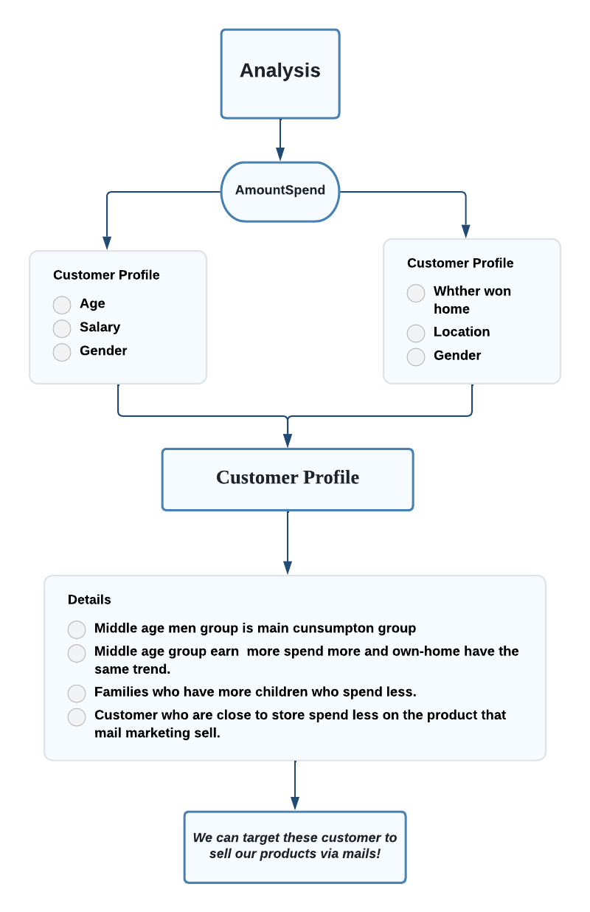
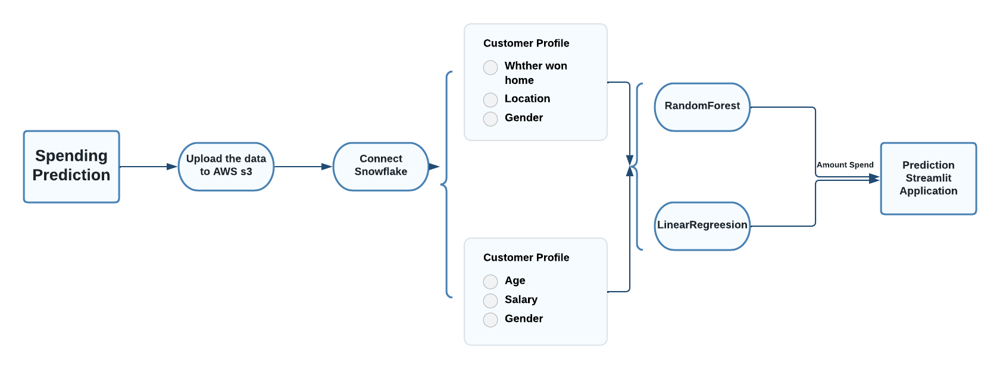
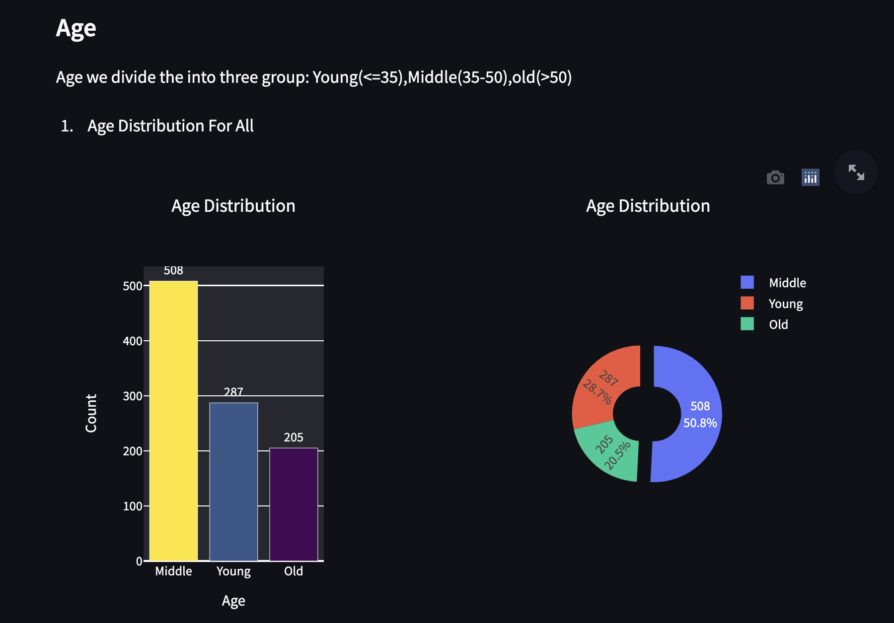
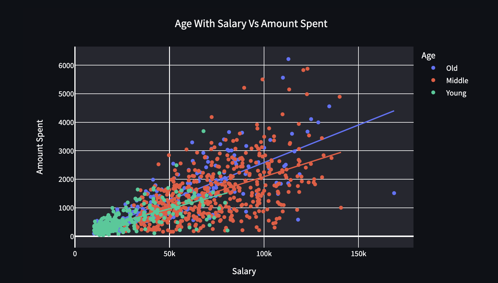
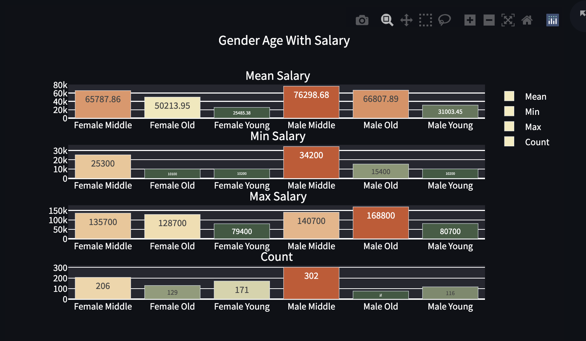
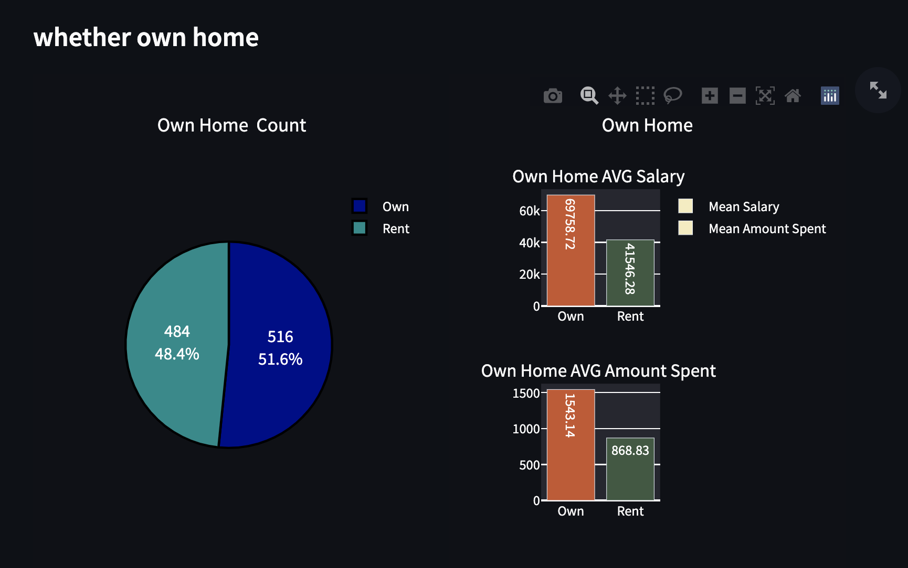
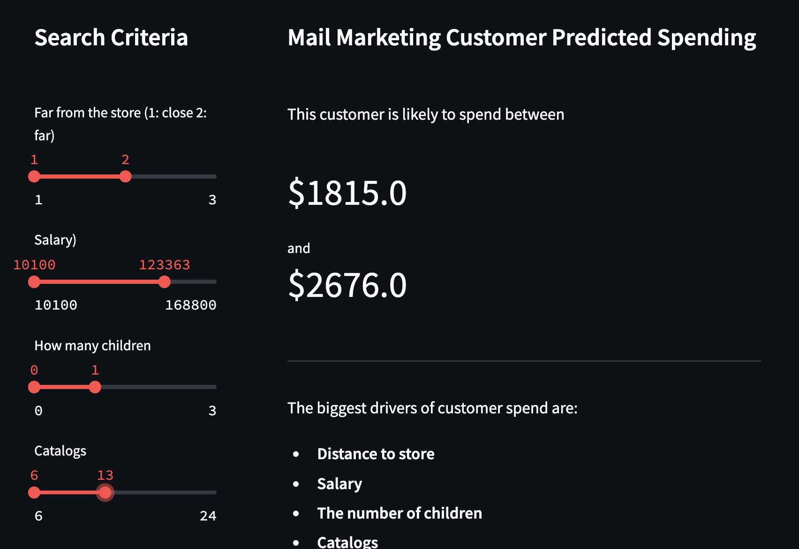

# Final Project: Mail Marketing Prediction

Currently, there are lots of marketers who still insist on selling their products directly via the mail. They send catalogs with product characteristics to customers who then directly from the catalogs. Therefore, we want to learn that marketers have developed customer records to learn what makes some customers spend more than others and predict their spending.

For this project: we have two parts: 
Customer Profile
AmountSpend Prediction

The Final project Colab Links: https://codelabs-preview.appspot.com/?file_id=1DGxPHbnSUL-hXrzw__vSHDAQc2IH3iPWU_RjWQn6gzY#3

## Part 1: Customer Profile Analysis

## Part 2: Spending Prediction

## Part 3: Application Result Show (part)

